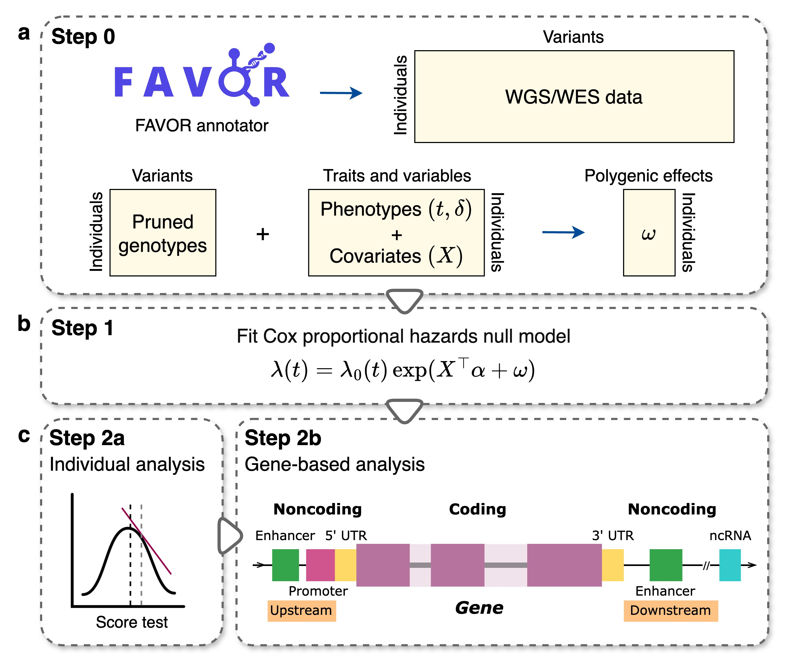

# SurvSTAAR (Survival analysis in variant-Set Test for Association using Annotation infoRmation)


## Description
SurvSTAAR is an R package for performing variant-Set Test for Association using Annotation infoRmation (STAAR) procedure in whole-genome sequencing (WGS) studies in time-to-event traits. 
SurvSTAAR is a general framework that incorporates both qualitative functional categories and quantitative complementary functional annotations using an omnibus test SurvSTAAR-O. 
SurvSTAAR accounts for population structure and sample relatedness, and addresses challenges posed by heavily censored phenotypes and low-frequency variants.


## Workflow Overview



## Prerequisites
<a href="https://www.r-project.org">R</a> (recommended version >= 4.0.0)

For optimal computational performance, it is recommended to use an R version configured with the Intel Math Kernel Library 
(or other fast BLAS/LAPACK libraries). See the <a href="https://software.intel.com/en-us/articles/using-intel-mkl-with-r">instructions</a> on building R with Intel MKL.


## Dependencies
SurvSTAAR imports R packages 
<a href="https://cran.r-project.org/web/packages/survival/index.html">survival</a>,
<a href="https://cran.r-project.org/web/packages/Matrix/index.html">Matrix</a>, 
<a href="https://cran.r-project.org/web/packages/data.table/index.html">data.table</a>,
<a href="https://cran.r-project.org/web/packages/CompQuadForm/index.html">CompQuadForm</a>,
<a href="https://cran.r-project.org/web/packages/seqminer/index.html">seqminer</a>,
<a href="https://cran.r-project.org/web/packages/dplyr/index.html">dplyr</a>,
<a href="https://bioconductor.org/packages/release/bioc/html/SeqArray.html">SeqArray</a>,
<a href="https://bioconductor.org/packages/release/bioc/html/SeqVarTools.html">SeqVarTools</a>,
<a href="https://bioconductor.org/packages/release/bioc/html/GenomicFeatures.html">GenomicFeatures</a>,
and <a href="https://bioconductor.org/packages/release/data/annotation/html/TxDb.Hsapiens.UCSC.hg38.knownGene.html">TxDb.Hsapiens.UCSC.hg38.knownGene</a>.
These dependencies should be installed before installing SurvSTAAR.


## Installation
```
install.packages(c("survival", "Matrix", "data.table", "CompQuadForm", "seqminer", "dplyr"))

if (!require("BiocManager", quietly = TRUE))
    install.packages("BiocManager")

BiocManager::install(c("SeqArray", "SeqVarTools", "GenomicFeatures", "TxDb.Hsapiens.UCSC.hg38.knownGene"))

devtools::install_github("Cui-yd/SurvSTAAR", ref = "main")
```

## Usage
Please see the <a href="SurvSTAAR/inst/scripts/toy_examples.R"> SurvSTAAR examples </a> using a toy data for example analyses of sequencing data using the SurvSTAAR procedure. 
Please see the <a href="https://github.com/Cui-yd/SurvSTAARpipeline">**SurvSTAARpipeline** </a> for scripts to analyze sequencing data using SurvSTAAR on High Performance Cluster (HPC) or the UK Biobank Research Analysis Platform (UKB RAP).


## Data Availability
The whole-genome functional annotation data assembled from a variety of sources and the precomputed annotation principal components are available at 
the [Functional Annotation of Variant - Online Resource (FAVOR)](https://favor.genohub.org) site and [FAVOR Essential Database](https://doi.org/10.7910/DVN/1VGTJI).


## Version
The current version is 0.1.1 (April 10, 2025).


## License
This software is licensed under GPLv3.


[GNU General Public License, GPLv3](http://www.gnu.org/copyleft/gpl.html)
